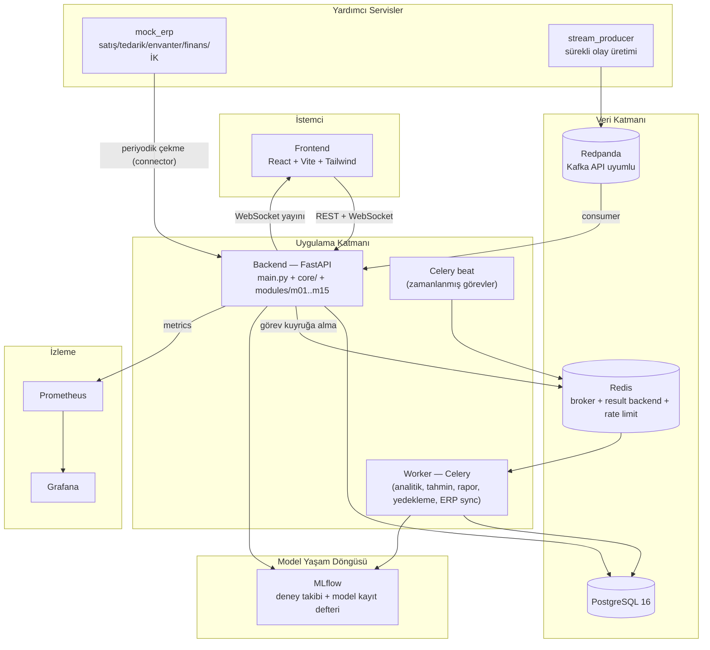
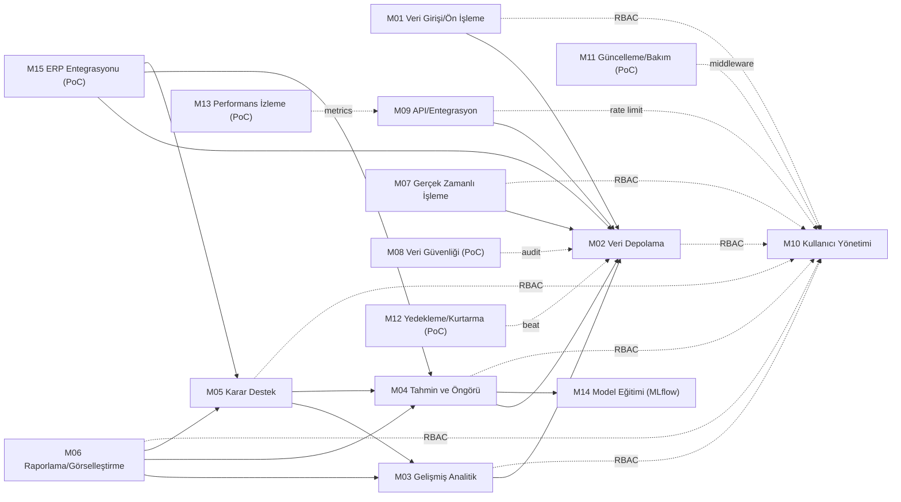
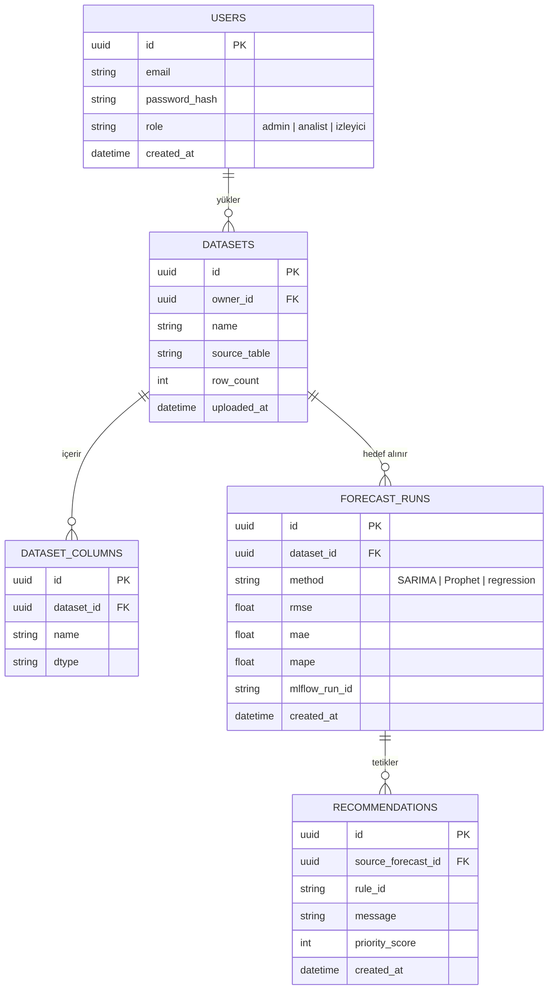
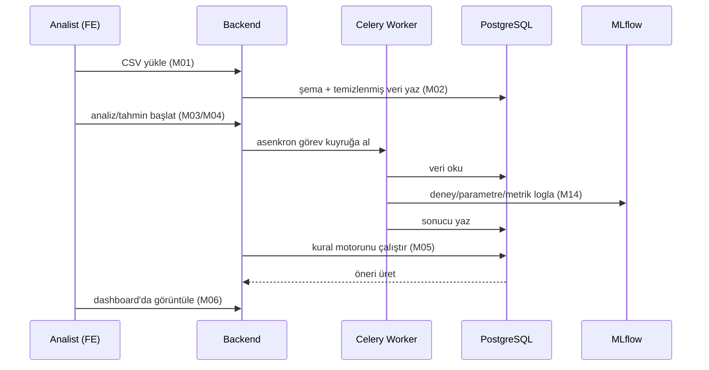

# DatAIntel — Mimari Doküman

> Bu doküman kod öncesi üretilen `docs/SOTA.md` (teknoloji seçim gerekçeleri) ve
> `docs/SRS.md`'nin (FR/NFR, personalar, izlenebilirlik matrisi) üzerine kurulur;
> onlardaki gerekçeleri tekrar üretmez. Mimari kararların kanonik kaynağı
> [`CLAUDE.md`](../CLAUDE.md)'dir; bu doküman onu görselleştirir.

## 1. Katman Şeması

## 2. Modül Bağımlılık Grafiği

Kural (bkz. CLAUDE.md § Kod Konvansiyonları, SRS NFR-M-4): bağımlılık **tek
yönlü**, yüksek numaralı modül düşük numaralıyı `service.py` üzerinden
kullanabilir; hiçbir modül başka bir modülün `router.py`'sini import edemez.

Not: kesikli oklar ("RBAC", "audit", "metrics") doğrudan servis çağrısı değil,
çapraz kesen (cross-cutting) bağımlılıkları gösterir — `core/auth.py`,
`core/logging.py`, `core/metrics.py` üzerinden merkezi olarak sağlanır, modül
kendi kendine yeniden implemente etmez.

## 3. ER Diyagramı (Çekirdek Şema)

Aşağıdaki şema, Gün 3+'ta modül geliştirme sırasında Alembic migration'larıyla
kurulacak çekirdek tabloları gösterir; her modülün kendi PoC/tam işlevine özgü
ek tablolar (ör. `decision_rules`, `dashboards`, `audit_log`, `api_keys`,
`backup_jobs`) ilgili modülün geliştirme oturumunda eklenecektir.

## 4. Veri Akışı (Uçtan Uca Senaryo)

## 5. Servis Portları (Yerel Geliştirme)

| Servis | Host portu | Container içi port | Not |
|---|---|---|---|
| frontend | 5173 | 5173 | Vite dev server |
| backend | 8000 | 8000 | FastAPI, `/docs` = OpenAPI (M09) |
| postgres | **5433** | 5432 | Host'ta 5433: bu makinede native PostgreSQL 17 zaten 5432'yi kullanıyor. Container-içi iletişim (`postgres:5432`) etkilenmez. |
| redis | 6379 | 6379 | |
| redpanda | 9092 | 9092 | Kafka API |
| mlflow | **5001** | 5000 | Host'ta 5001: bu makinede macOS ControlCenter/AirPlay Receiver 5000'i kullanıyor. Container-içi iletişim (`mlflow:5000`) etkilenmez. |
| prometheus | 9090 | 9090 | |
| grafana | 3000 | 3000 | |
| mock_erp | 8001 | 8001 | |

## 6. Açık Notlar

- Docker bu makineye kuruldu; `docker compose up -d` ile **12 servisin tamamı**
  gerçekten ayağa kaldırılıp doğrulandı (Gün 2 sonu):
  - Host'ta iki port çakışması bulundu ve çözüldü (postgres → 5433, native
    PostgreSQL 17 ile çakışıyordu; mlflow → 5001, macOS ControlCenter/AirPlay
    ile çakışıyordu).
  - `postgres` ve `prometheus` container'ları ilk denemede tek-dosya bind
    mount (`./dosya.yml:/hedef/dosya.yml`) yüzünden Docker Desktop VM
    seviyesinde kilitlendi (`docker rm -f` bile yanıt vermedi). Kalıcı çözüm:
    her ikisi de artık dizin bazlı mount kullanıyor
    (`./docker/postgres-initdb:/docker-entrypoint-initdb.d`,
    `./monitoring/prometheus:/etc/prometheus`).
  - Sonuç: `backend` `/health` ve `/docs`, `mock_erp` `/health`, `mlflow`,
    `prometheus`, `grafana`, `frontend` (5173) hepsi 200 döndü; `worker`/`beat`
    Redis'e bağlanıp hazır duruma geçti; `postgres`/`redis` healthy.
- Prophet kurulum sorunlarına karşı SARIMA'ya düşme kuralı (FR-04-2, SOTA §4.3)
  bu diyagramlarda ayrıca gösterilmedi; `M04` servis katmanında try/fallback
  olarak uygulanacak.
